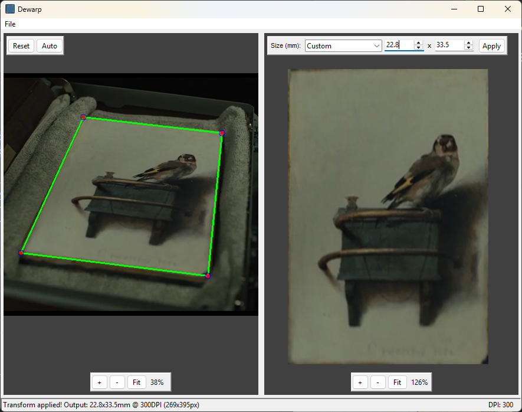

# Dewarp

An interactive perspective transform tool for correcting image distortion. Select 4 corner points on a distorted image and dewarp will automatically straighten and correct the perspective. If real world dimensions (mm, inch or pixels) are known, they can be added on the right page.



## Features

- **Interactive Point Selection**: Click to select 4 corner points on your document
- **Drag-and-Drop Adjustment**: Click and drag any point to fine-tune its position
- **Smart Quadrilateral Display**: Green lines automatically connect points to form a proper quadrilateral, even if points are placed in unusual order
- **Zoom & Pan**: Mouse wheel zoom (centered on cursor) and left-click pan for precise point placement
- **Auto-Calculated Dimensions**: Automatically calculates output dimensions from selected points
- **Scale Calibration**: Click two points on a known distance (before or after transform) to set precise real-world scale
  - Works on original image before transformation
  - Works on result image after transformation
  - Draggable scale endpoints for fine-tuning
- **Flexible Units**: Output size in millimeters, inches, or pixels with configurable DPI
- **Real-time Visual Feedback**: Clean point markers with green connecting lines
- **Two Transform Modes**:
  - **Full Image Mode** (default): Transforms entire image, keeping everything in frame
  - **Crop Mode**: Crops to selected quadrilateral only
- **Responsive Layout**:
  - Side-by-side view on wide screens
  - Automatic tabbed view on narrow screens (iPhone-style)
  - Smooth transitions with hysteresis
- **Context Menu Options** (Right-click):
  - Set scale by clicking two points
  - Rotate images 90 degrees clockwise or counter-clockwise
  - Flip images horizontally or vertically
  - Toggle crop mode (result image only)
  - Use result as original for iterative editing
  - Save result
- **Image Transformation**: Rotate or flip original or result images
- **Iterative Workflow**: Use transformed result as new original for multi-step corrections
- **Save Results**: Export transformed images maintaining original file format (JPG/PNG/BMP)
- **Preferences Dialog**: Configure DPI, units, and crop mode settings
- **HEIC Support**: Load and process HEIC/HEIF images from iPhone and other Apple devices

## Installation

### Option 1: Using requirements.txt (Traditional)

```bash
pip install -r requirements.txt
```

### Option 2: Using pyproject.toml (Modern)

```bash
pip install -e .
```

### Dependencies

- **opencv-python** (cv2): Advanced perspective transforms, color conversion, text rendering
- **cv3**: Pythonic OpenCV wrapper for basic I/O and drawing operations
- **numpy**: Numerical operations and array handling
- **Pillow**: GUI image display
- **pillow-heif**: HEIC/HEIF image format support

## Usage

### Quick Start

```bash
# Start with file dialog
python dewarp.py

# Or load an image directly
python dewarp.py path/to/image.jpg

# Use test image
python dewarp.py test/test_image_warped.png
```

### Command Line Options

```bash
python dewarp.py [image] [options]

Arguments:
  image                    Path to image file (optional, will prompt if not provided)

Options:
  --dpi <value>           Set DPI for dimension conversion (default: 300)
  --units <mm|inches|pixels>  Set measurement units (default: mm)
  --crop                  Enable crop mode to crop to selected points
                         (default: transform entire image)
```

**Examples:**

```bash
# Use inches with 150 DPI
python dewarp.py --units inches --dpi 150 image.jpg

# Crop mode with pixels
python dewarp.py --crop --units pixels image.jpg

# High resolution scan mode
python dewarp.py --dpi 600 --units mm document.jpg
```

### Interactive Workflow

1. **Load Image**:
   - Click `File -> Load Image` or press `Ctrl+O`
   - Or provide image path as command line argument

2. **Set Scale** (Optional - Method 1):
   - Right-click on original image -> "Set Scale..."
   - Click two points on a line with known real-world distance
   - Enter the actual length (in mm, inches, or pixels)
   - Scale endpoints can be dragged to adjust position
   - Dialog appears automatically after second point

3. **Select Corners**:
   - Click on 4 corner points (any order - they're auto-sorted)
   - Red filled circles with blue outlines
   - Green lines automatically connect to form proper quadrilateral
   - Lines update intelligently if points are crossed

4. **Adjust Points** (Optional):
   - **Zoom In/Out**: Mouse wheel or `+`/`-` buttons
   - **Zoom to Fit**: Click `Fit` button
   - **Pan**: Left-click and drag after 4 points placed
   - **Drag Points**: Click and drag any point to adjust precisely
   - **Current Zoom**: Displayed as percentage in upper-right

5. **Review Dimensions** (auto-calculated):
   - After selecting 4 points, dimensions are calculated from point distances
   - Width = average of top and bottom edge lengths
   - Height = average of left and right edge lengths
   - Dimensions update as you drag points (until manually edited)
   - Manual edits lock the dimensions
   - If scale was calibrated, dimensions use scale factor instead of DPI

6. **Configure Settings** (Optional):
   - Click `File -> Preferences` to adjust:
     - DPI (dots per inch)
     - Units (mm, inches, or pixels)
     - Crop mode (on/off)
   - Or right-click on result -> "Crop Mode" to toggle

7. **Apply Transform**:
   - Click `Apply` button
   - View result in right pane (or Result tab on narrow screens)
   - Status bar shows output dimensions

8. **Set Scale** (Optional - Method 2):
   - Right-click on result image -> "Set Scale..."
   - Click two points on the transformed image
   - Enter known distance to calibrate scale
   - Useful for post-transform measurement verification

9. **Refine Result** (Optional):
   - **Rotate**: Right-click -> "Rotate 90 deg CW/CCW"
   - **Flip**: Right-click -> "Flip Horizontal" or "Flip Vertical"
   - **Iterate**: Right-click on result -> "Use as Original" to perform additional transforms
   - **Adjust Crop**: Toggle crop mode to change output framing

10. **Save Result**:
    - Click `File -> Save Result` or press `Ctrl+S`
    - Or right-click on result -> "Save Result..."
    - Choose location and format (JPG/PNG/BMP)

### Keyboard Shortcuts

- `Ctrl+O`: Load Image
- `Ctrl+S`: Save Result (when available)
- `Alt+F4`: Exit

### Mouse Controls

| Action | Effect |
|--------|--------|
| **Left-Click** | Add corner point (if < 4), start scale calibration, or select/drag existing point |
| **Left-Click + Drag** | Pan (after 4 points placed) or drag selected point/scale endpoint |
| **Right-Click** | Open context menu with image-specific options |
| **Mouse Wheel Up** | Zoom in (centered on cursor) |
| **Mouse Wheel Down** | Zoom out (centered on cursor) |

### Context Menu Options

Right-click on either image to access context-sensitive options:

**Original Image (Left/Original Tab):**
- Set Scale... - Calibrate scale using two known points
- Rotate 90 deg CW/CCW - Rotate original image
- Flip Horizontal - Mirror original image left-to-right
- Flip Vertical - Mirror original image top-to-bottom

**Result Image (Right/Result Tab):**
- Save Result... - Export transformed image
- Use as Original - Move result to left pane for iterative editing
- Set Scale... - Calibrate scale on transformed image
- Rotate 90 deg CW/CCW - Rotate result image
- Flip Horizontal - Mirror result image left-to-right
- Flip Vertical - Mirror result image top-to-bottom
- Crop Mode - Toggle between full image and crop-to-quadrilateral

### Transform Modes

#### Full Image Mode (Default)
Transforms the entire image, treating the selected quadrilateral as a reference area with known dimensions. The full image is dewarped based on this reference, keeping all content in the output.

**Use case**: Scanning a card or document on a larger surface where you want to keep everything in frame.

#### Crop Mode (`--crop` flag)
Crops the output to exactly the selected quadrilateral region, discarding everything outside.

**Use case**: Extracting just the document/card itself.

### Dimension Calculation

Dimensions are **automatically calculated** based on your selected points:

1. After selecting 4 corner points, distances between them are measured
2. Averages opposing sides (top/bottom for width, left/right for height)
3. Converts pixel distances to selected units using:
   - **Scale factor** (if calibrated via "Set Scale...")
   - **DPI** (if no scale calibration)
4. Updates automatically as you drag points
5. Manual editing locks dimensions (click `Reset` to re-enable auto-calc)

**Conversion Formulas**:
- With DPI: `pixels = (mm / 25.4) x DPI` or `pixels = inches x DPI`
- With Scale: `units = pixels / scale_factor`

**Example**: 210mm @ 300 DPI = 2,480 pixels

### Scale Calibration

For more precise measurements, use scale calibration instead of DPI:

1. **Before Transform**: Right-click original -> "Set Scale..."
   - Click two points on a known distance (e.g., ruler, grid line)
   - Enter real-world length
   - Transform will use this scale for dimensions

2. **After Transform**: Right-click result -> "Set Scale..."
   - Useful for verifying or setting scale on transformed output
   - Click two points and enter known distance

3. **Adjusting Scale Points**:
   - Drag scale endpoints to fine-tune position
   - Scale line shown in cyan with small circular endpoints
   - Dialog appears automatically after placing second point

**Use Cases**:
- Images with rulers or measurement tools visible
- Documents with known dimensions (e.g., ID cards, paper sizes)
- Technical drawings with scale bars
- When DPI information is unreliable or unknown

## Project Structure

```
dewarp/
|-- dewarp.py              # Main application
|-- README.md              # This file
|-- requirements.txt       # Traditional dependency list
|-- pyproject.toml         # Modern Python project config
|-- assets/                # Application assets
|   `-- dewarp.ico        # Application icon
|-- tools/                 # Utility scripts
|   |-- generate_icon.py          # Icon generator
|   `-- generate_test_image.py    # Test image generator
`-- test/                  # Test images (gitignored)
    |-- test_image_original.png   # Original test image
    |-- test_image_warped.png     # Pre-warped test image
    `-- test_image_metadata.json  # Transform metadata
```

## Testing

### Test Images

The project includes test image generation:

```bash
# Generate test images
python tools/generate_test_image.py

# Test the application
python dewarp.py test/test_image_warped.png
```

**Test image specs**:
- 22x30 cm green background with rounded corners
- 1 cm grey grid (starting 1 cm from border)
- Two rotated rectangles (2x3 inches and 7x5 cm)
- Pre-warped with known transform matrix
- Dark grey background for realistic appearance

Select the 4 rounded corners and apply the transform to verify the output matches the original.

## Tips for Best Results

- **Lighting**: Ensure good, even lighting and high contrast
- **Point Placement**: Place points precisely on corners using zoom
- **Scale Calibration**: Use "Set Scale..." for most accurate measurements when DPI is unknown
- **Grid Lines**: Use the grid (if visible) to verify straightness
- **Full Resolution**: Display is scaled but transform uses full resolution
- **Point Order**: Select in any order - automatic sorting handles it
- **Manual Dimensions**: Lock dimensions by typing values before applying transform
- **Iterative Editing**: Use "Use as Original" to apply multiple transforms sequentially
- **Rotation & Flipping**: Rotate or flip images before or after transform as needed
- **Responsive View**: Resize window to switch between side-by-side and tabbed layouts
- **Context Menu**: Right-click on either image for quick access to tools
- **Pre-processing**: Use flip/rotate on original to correct orientation before selecting points

## How It Works

Dewarp uses OpenCV's perspective transformation functions to correct distorted images:

1. **Point Selection**: User selects 4 corner points defining a quadrilateral
2. **Point Ordering**: Points are automatically sorted (top-left, top-right, bottom-right, bottom-left)
3. **Dimension Calculation**: Measures distances and calculates real-world dimensions
4. **Transform Matrix**: Computes perspective transform using `cv2.getPerspectiveTransform()`
5. **Image Warping**: Applies transform with `cv2.warpPerspective()`
6. **Output Scaling**: Converts dimensions from selected units to pixels using DPI

The application uses two complementary libraries:
- **cv3**: Pythonic wrapper for image I/O and drawing
- **cv2**: Advanced functions for perspective transforms and color conversion

## Development

### Regenerate Icon

```bash
python tools/generate_icon.py
```

Generates multi-resolution icon (16x16 to 256x256) in `assets/dewarp.ico`.

### Regenerate Test Images

```bash
python tools/generate_test_image.py
```

Creates test images with known transform in `test/` directory.

## License

MIT

## Author

Built with OpenCV, cv3, and tkinter.
